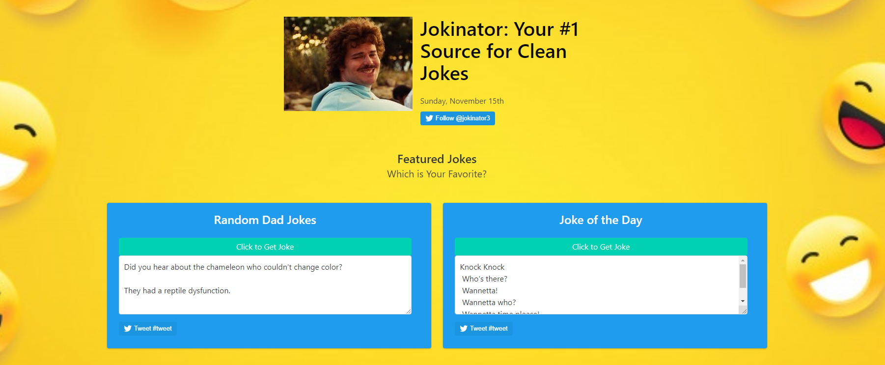
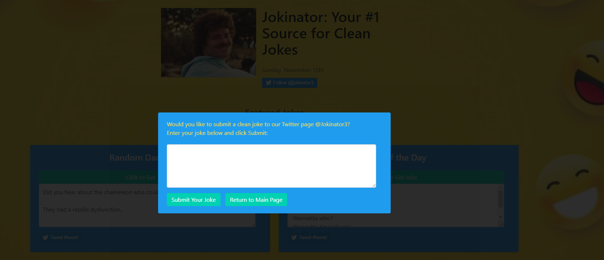

# Jokinator
Your #1 Source for Clean Jokes, come see it at 
https://jamescostello-dev.github.io/jokinator/

## Purpose
* To create a real-world front-end application that our team can showcase to potential employers. We are to use the skills and technologies we have learned over the past six weeks, including deployment, interactivity, client-side storage, responsive design, and polished UI.

## User Story
* Given a joke generator, I want to laugh.
* When I click “Get Joke” in the first window,
* Then a random Dad Joke is displayed.
* When I click “Get Joke” in the second window,
* Then the Joke of the Day is displayed.
* When the button to submit your own joke is clicked,
* Then a modal prompts a user to submit his/her own joke.
* When the user enters a joke,
* That joke will be stored in Local Storage and then displayed on @Jokinator3.
* When a button labeled Tweet is clicked, 
* Then the user is redirected to his/her Twitter account to share the joke.
* When the button labeled Follow is clicked,
* Then the user is invited to Follow  @Jokinator3 on Twitter.
 
## When asked his opinion on the Jokinator, this was Nacho Libre’s response:

## Built With
* CSS
* Bulma
* HTML
* Moment.js
* Twitter api
* https://jokes.p.rapidapi.com/jod?category=knock-knock
* https://dad-jokes.p.rapidapi.com/random/joke
* jQuery
* JavaScript
* Fontawesome.com

## Screenshots

## Website:
https://jamescostello-dev.github.io/jokinator/

## Future Development
* Using Twitter as a storage method
* SMS and email delivery API’s
* Server/Database integration for stored user data

## Contributions
*James Costello
*Joe Riley
*Amie Carroll
*Mark Manalo
*Sheila Kiprotich
